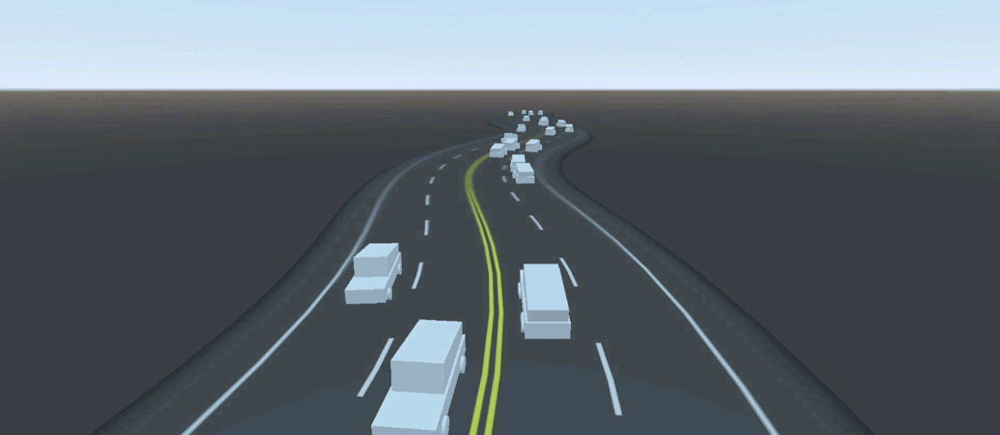
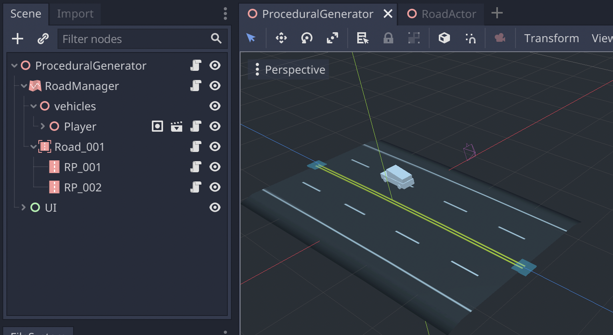
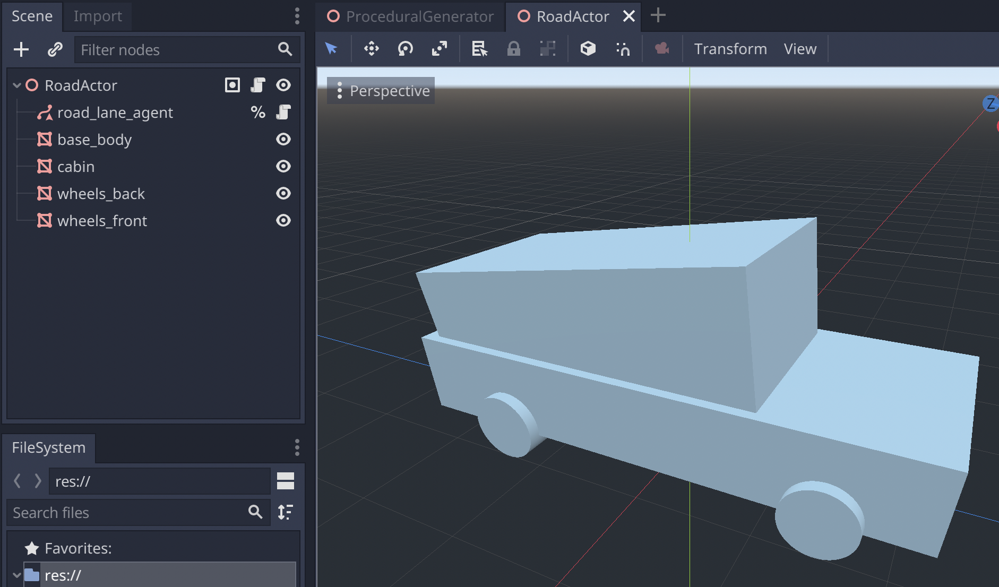

# Procedural generator

This demo shows off how to use the Godot Road Generator where the roads are made procedurally in-game with a basic example of how to use RoadLane and RoadLaneAgents for AI traffic.

This demo is aimed to be as basic as possible so it is easy to follow, thus the behavior of the path-following cars is reduced to simply going forward along the road lines without any consideration for collisions. We also do not introduce any branching or prefab scene placement.

See [demo videos here](https://github.com/TheDuckCow/godot-road-generator/issues/170). This demo exists thanks to the support of @brickyt via our [Roadside Support Patreon tier](https://www.patreon.com/WheelStealGame).

## High level structure

This demo has the following components:

**procedural_generator.gd/tscn** - the main demo scene. This controls the placement of both new roads and cars ("actors"). 

- Script is attached to the root
- The addon-provided RoadManager node is a child, which itself has one RoadContainer child and one other child used to place all cars including the player's
- The player instance of the RoadActor is added to the scene, state set to player, visualize_lane set to true, and auto-register set to false (to avoid any risk of automatic culling when freeing RoadLanes)

**road_actor.gd/tscn** - The vehicles that appear on the road, with export vars to differentiate a player driven vs "AI" driven vehicle

- Extends from a spatial, so there are no actual physics happening
- Has a child RoadLaneAgent which is provided by the road generator, a utility function to keep tracking along the road

## Generating and culling roads

The starting ProceduralGenerator.tscn file is saved with one RoadContainer holding the starting 2x2 road segment. Each physics frame, we check the edges of this RoadContainer to decide - per edge - whether we need to add or remove a road segment based on the camera's position. Edges are defined as RoadPoints within a container which are not connected in both directions, thus have at least one opening to connect to. To do this culling, there is a "near buffer" and a "far buffer". These buffer distances create 3 "zones" for any given edge RoadPoint to be in:

- Closer to player than the near buffer: Add another roadpoint (the game start keeps doing this until the road has extended out to beyond the near buffer, no special startup logic to fill the first roads!)
- Between the two buffers: Do nothing
- Further out than the far buffer: Delete a roadpoint

The distance between the close and far buffer must be wide enough, or else you may encounter flickering where you keep adding a RoadPoint and then remove it on the next frame. To avoid this, the buffer distance must be at least as wide as the largest distance between tow roads being placed. This is also where a performance tradeoff comes into play: creating large distances between RoadPoints means your buffer also has to be very far. That means when a RoadPoint is added, much more geometry needs to be created on a single frame which can create a lag spike.

### Add a RoadPoint / RoadSegment

Once we determine we need to add another RoadPoint to extend one edge of the road, we have to decide *where* to place this new RoadPoint. We take the current edge's position, take it's z-basis direction, rotate it slightly by some number of degrees, and then extend the roadpoint out in that direction.

This is a very simplicity method to place roads, but will not look that organic. This is because each RoadPoint placement is entirely independent to the prior one placed. To create more interesting curves and road designs, you'd need to perform more logic to define a "plan" for how to place several RoadPoints in sequence.

### Deleting a RoadPoint / RoadSegment

A little easier than adding, we simply need to queue free the roadpoint and free up the resources. A RoadPoint is the parent of a RoadSegment and the actual physical mesh of the road, RoadLanes, and collision mesh. By removing the RoadPoint parent, you clean up these resources too. However in this demo, we don't parent the vehicles to the RoadLanes themselves (this helps to avoid having to parent and re-parent the cars each time they move between segments). For that, we instead have the concept of "vehicle registration" on each RoadLane. The code thus has a routine to free any cars across RoadLanes which are a child of the RoadPoint about to be removed.

### Asymmetric culling

It's worth recognizing that as-is, the demo's creation and culling is technically asymmetric based on the direction of travel. This is because, as mentioned, RoadPoints are treated as the cross section of a road at one position, while the RoadSegment mesh connecting two roadpoints is actually the child of one RoadPoint or another. Any given RoadSegment is of course only the child of one roadpoint or the other, and it should be considered arbitrary which way it lands (it's consistent which way it chooses, but should not be depended on). Therefore, this buffer approach will make the roads always be a little bit further away going one direction, and closer in the other.

In this demo, you could somewhat simply account for this by virtually offsetting the considered position of the player. However, in more complex example where you can't guarantee that all road points are "facing" the same way, you wouldn't be able to make this assumption. An alternate, slightly more complex but visually symmetric solution, would be to not use the position of a RoadPoint itself, but rather do culling based on each individual RoadSegment's centroid ("each" because there technically could be two road segments on one RoadPoint, or even None, if two roads facing different directions are connected together).

## Cars following the road

The player and NPC cars are simply spatials who use the addon provided RoadLaneAgent node in order to track along the generated AI lanes. Given there are no physics happening here, we can exactly move along the RoadLane by the amount we want the vehicle to move on that frame, and then snap to that position. If you were to extend this demo to support simulated vehicles with physics, you would instead use this agent to create one or more tracking target points to steer towards, likely somewhere in front of your actual vehicle/actor. 

The RoadLaneAgent nicely abstracts the transition between one RoadLane and the next. During any given "move along" call, a vehicle might need to jump from the RoadLane on one segment to another, and continuing the distance on the next section without any stutter. The Player instance is saved with the export var visualize_lane set to true, so you can see exactly which lane it is tracking towards in the game, which can also be very useful for debugging traffic behavior on an individual agent basis.

Each RoadLaneAgent also contains a reference to its current RoadLane, and has a method to auto find the next nearest RoadLane. In a real simulated scenario, you might set some limits on how far away a vehicle can get from the nearest or current lane before it switches into a "find lane" wandering state.
